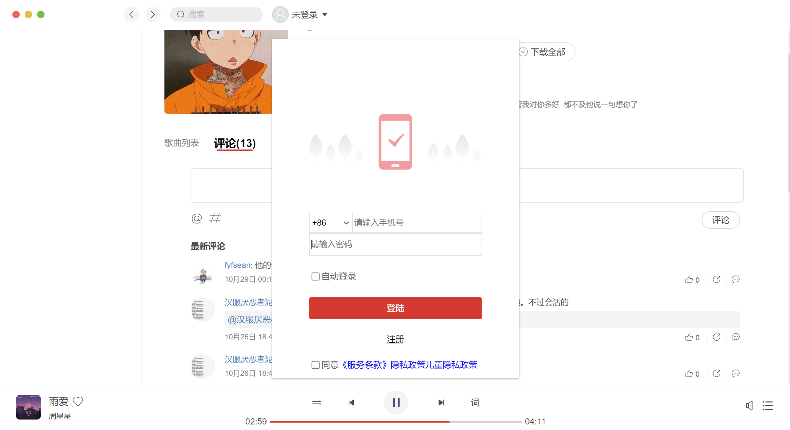

# clound-music

## Project setup
```
npm install
```

### Compiles and hot-reloads for development
```
npm run serve
```

### Compiles and minifies for production
```
npm run build
```

### Customize configuration


### 项目描述

1. 使用技术栈：vue全家桶、element UI ...

2. 结合Mac端和Windows端，仿网易云音乐PC端

   

### 部分截图


<br/>
See [Configuration Reference](https://cli.vuejs.org/config/).
# 




